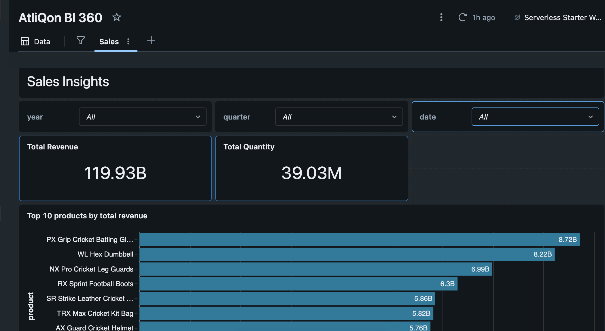

# 🏅 AtliQon & SportBar Data Integration Pipeline

> **A Databricks-based ELT pipeline for merging and consolidating sports retail data from an acquired company into the parent company's data warehouse.**

---

## Project Overview

**AtliQon**, a leading sports articles retailer, recently acquired **SportBar**, a supplier of sports nutrition and wellness products. This project implements a robust data integration pipeline that:

1. **Ingests** SportBar's OLAP data from AWS S3
2. **Transforms** the data through Bronze → Silver → Gold layers using the Medallion Architecture
3. **Merges** SportBar's gold-level data with AtliQon's existing data warehouse
4. **Enables** unified analytics through enriched views and dashboards

---

## Architecture

### High-Level Pipeline Fusion Architecture


The pipeline orchestrates data flow from SportBar's source systems through Databricks' lakehouse architecture, ultimately merging with AtliQon's consolidated data warehouse.

---

## Data Storage

### AWS S3 External Data Lake


SportBar's raw data is stored in AWS S3 buckets (`s3://sportsbar-enge/`) organized by data source:
- `/customers/` - Customer master data
- `/products/` - Product catalog
- `/gross_price/` - Pricing information
- `/orders/landing/` - Incoming order transactions
- `/orders/processed/` - Processed order files

### External Data Connection


Databricks connects to the S3 bucket using external storage credentials, enabling seamless data ingestion from the cloud data lake.

---

## Medallion Architecture (Bronze → Silver → Gold)

### Data Layers Overview


| Layer | Purpose | Key Operations |
|-------|---------|----------------|
| **Bronze** | Raw data ingestion | Schema inference, metadata enrichment (timestamps, file info) |
| **Silver** | Cleaned & transformed data | Deduplication, data type casting, standardization, data quality fixes |
| **Gold** | Business-ready data | Aggregations, dimensional modeling, merged parent-child data |

### Processing Pipeline Details

#### 🥉 Bronze Layer
- Ingests raw CSV files from S3
- Adds metadata columns (`read_timestamp`, `file_name`, `file_size`)
- Stores data in Delta format with Change Data Feed enabled

#### 🥈 Silver Layer
- **Customers**: City name standardization, customer attribute enrichment
- **Products**: Category normalization, spelling corrections, variant extraction, product code generation
- **Orders**: Date parsing, customer/product ID validation, duplicate removal

#### 🥇 Gold Layer
- Dimension tables: `dim_customers`, `dim_products`, `dim_gross_price`, `dim_date`
- Fact tables: `fact_orders`, `sb_fact_orders`
- Merged tables combining AtliQon and SportBar data

---

## Incremental Data Processing

The pipeline supports **incremental loading** for order data:

1. **Landing Zone Detection**: New CSV files are detected in the landing directory
2. **Staging Tables**: Incremental data is processed through staging tables
3. **Delta Merge Operations**: Data is merged using `whenMatchedUpdateAll()` and `whenNotMatchedInsertAll()` patterns
4. **Monthly Aggregation**: Daily SportBar data is aggregated to monthly level to match AtliQon's data granularity
5. **File Movement**: Processed files are moved from `landing/` to `processed/` directories

---

## Jobs Pipeline

### Automated Workflow Orchestration


The Databricks workflow orchestrates the following notebooks in sequence:

| Step | Notebook | Description |
|------|----------|-------------|
| 1 | `1_customer_data_processing.py` | Ingests customer data from S3, cleans city names, standardizes attributes, and merges with AtliQon's `dim_customers` |
| 2 | `2_products_data_processing.py` | Processes product catalog, fixes spelling errors, generates product codes, and merges with AtliQon's `dim_products` |
| 3 | `3_pricing_data_processing.py` | Normalizes pricing data, handles multiple date formats, and merges with AtliQon's `dim_gross_price` |
| 4 | `2_incremental_load_fact.py` | Processes daily orders incrementally, aggregates to monthly level, and merges with AtliQon's `fact_orders` |

**Execution Flow:**

```
┌─────────────────────────────────┐
│  1. Customer Data Processing    │
│  (Bronze → Silver → Gold)       │
│  Merge → dim_customers          │
└───────────────┬─────────────────┘
                ▼
┌─────────────────────────────────┐
│  2. Products Data Processing    │
│  (Bronze → Silver → Gold)       │
│  Merge → dim_products           │
└───────────────┬─────────────────┘
                ▼
┌─────────────────────────────────┐
│  3. Pricing Data Processing     │
│  (Bronze → Silver → Gold)       │
│  Merge → dim_gross_price        │
└───────────────┬─────────────────┘
                ▼
┌─────────────────────────────────┐
│  4. Incremental Fact Orders     │
│  (Bronze → Silver → Gold)       │
│  Daily → Monthly Aggregation    │
│  Merge → fact_orders            │
└─────────────────────────────────┘
```

> **Note:** The dimension tables (customers, products, pricing) must be processed before the fact table, as the orders processing requires joins with the product dimension to retrieve `product_code`.

---

## Analytics Layer

### Enriched View for Reporting

A denormalized view (`fmcg.gold.vw_fact_orders_enriched`) is created to support analytics and dashboards:

```sql
CREATE OR REPLACE VIEW fmcg.gold.vw_fact_orders_enriched AS (
    SELECT 
        fo.date, fo.product_code, fo.customer_code,
        
        -- Date attributes
        dd.year, dd.month_name, dd.quarter, dd.year_quarter,
        
        -- Customer attributes
        dc.customer, dc.market, dc.platform, dc.channel,
        
        -- Product attributes
        dp.division, dp.category, dp.product, dp.variant,
        
        -- Metrics
        fo.sold_quantity, gp.price_inr,
        (fo.sold_quantity * gp.price_inr) AS total_amount_inr
    
    FROM fmcg.gold.fact_orders fo
    LEFT JOIN fmcg.gold.dim_date dd ON fo.date = dd.month_start_date
    LEFT JOIN fmcg.gold.dim_customers dc ON fo.customer_code = dc.customer_code
    LEFT JOIN fmcg.gold.dim_products dp ON fo.product_code = dp.product_code
    LEFT JOIN fmcg.gold.dim_gross_price gp 
           ON fo.product_code = gp.product_code AND YEAR(fo.date) = gp.year
);
```

### Dashboard



The dashboard provides insights into:
- Sales performance by product category and division
- Customer segmentation by market and channel
- Revenue trends over time (monthly/quarterly/yearly)
- Acquisition channel analysis (SportBar vs. legacy AtliQon)

---

## Technical Stack

| Component | Technology |
|-----------|------------|
| **Data Lake** | AWS S3 |
| **Data Platform** | Databricks Lakehouse |
| **Storage Format** | Delta Lake |
| **Processing Engine** | Apache Spark (PySpark) |
| **Orchestration** | Databricks Workflows |
| **Language** | Python, SQL |

---

## Project Structure

```
Databricls project/
├── consolidated_pipeline/
│   ├── 1_setup/
│   │   ├── setup_catalogs.py
│   │   ├── dim_date_table_creation.py
│   │   └── utilities.py
│   ├── 2_dimension_data_processing/
│   │   ├── 1_customer_data_processing.py
│   │   ├── 2_products_data_processing.py
│   │   └── 3_pricing_data_processing.py
│   └── 3_fact_data_processing/
│       ├── 1_full_load_fact.py
│       └── 2_incremental_load_fact.py
├── data/
│   ├── 1_parent_company/        # AtliQon source data
│   │   ├── full_load/
│   │   └── incremental_load/
│   └── 2_child_company/         # SportBar source data
│       ├── full_load/
│       └── incremental_load/
├── Queries/
│   └── denormalise_table_query_fmcg.txt
├── Viz/
│   ├── AWS S3 External Data.png
│   ├── Dashboard.png
│   ├── Data Layers.png
│   ├── External Data.png
│   ├── Jobs pipeline.png
│   └── Pipeline Fusion Architecture.png
└── README.md
```

---

## Getting Started

### Prerequisites
- Databricks workspace with Unity Catalog enabled
- AWS S3 bucket with appropriate IAM permissions
- External location configured in Databricks

### Setup Steps

1. **Configure S3 Connection**
   - Create storage credentials in Databricks
   - Set up external location pointing to `s3://sportsbar-enge/`

2. **Initialize Catalogs**
   ```sql
   CREATE CATALOG IF NOT EXISTS fmcg;
   CREATE SCHEMA IF NOT EXISTS fmcg.bronze;
   CREATE SCHEMA IF NOT EXISTS fmcg.silver;
   CREATE SCHEMA IF NOT EXISTS fmcg.gold;
   ```

3. **Run Pipeline Notebooks**
   - Execute notebooks in order from setup → dimensions → facts
   - Configure workflow for automated incremental processing

4. **Create Analytics View**
   - Run the query in `Queries/denormalise_table_query_fmcg.txt`
   - Connect BI tools to the enriched view

---

## Data Model

### Dimension Tables
| Table | Description | Key Columns |
|-------|-------------|-------------|
| `dim_customers` | Customer master | customer_code, customer, market, platform, channel |
| `dim_products` | Product catalog | product_code, division, category, product, variant |
| `dim_gross_price` | Yearly pricing | product_code, year, price_inr |
| `dim_date` | Date dimension | date_key, year, month_name, quarter |

### Fact Tables
| Table | Description | Grain |
|-------|-------------|-------|
| `fact_orders` | Consolidated orders (AtliQon + SportBar) | Monthly |
| `sb_fact_orders` | SportBar orders (staging) | Daily |

---

## Data Quality & Governance

- **Change Data Feed**: Enabled on all Delta tables for audit and CDC capabilities
- **Data Validation**: Customer/product ID validation with fallback values (999999)
- **Deduplication**: Applied at each layer to ensure data integrity
- **Standardization**: City names, product categories, and text fields normalized


